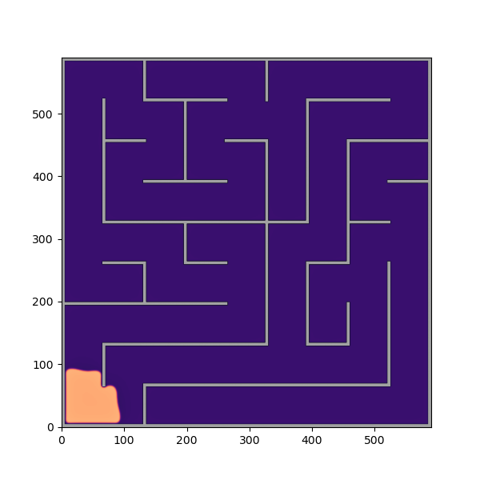
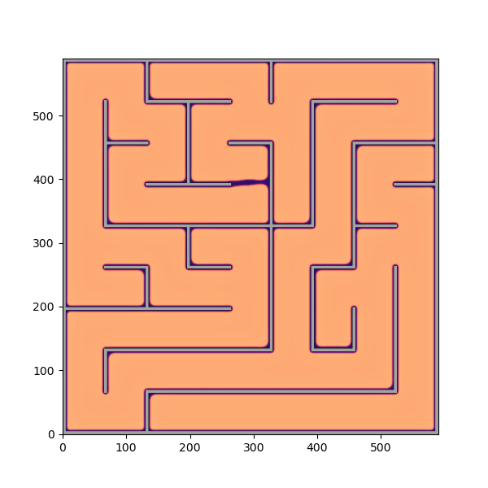
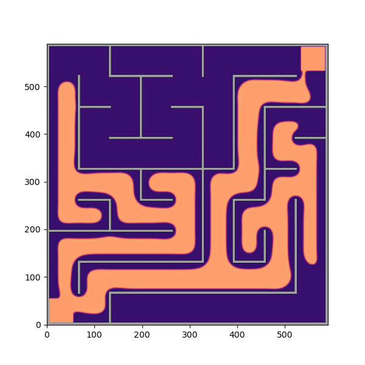
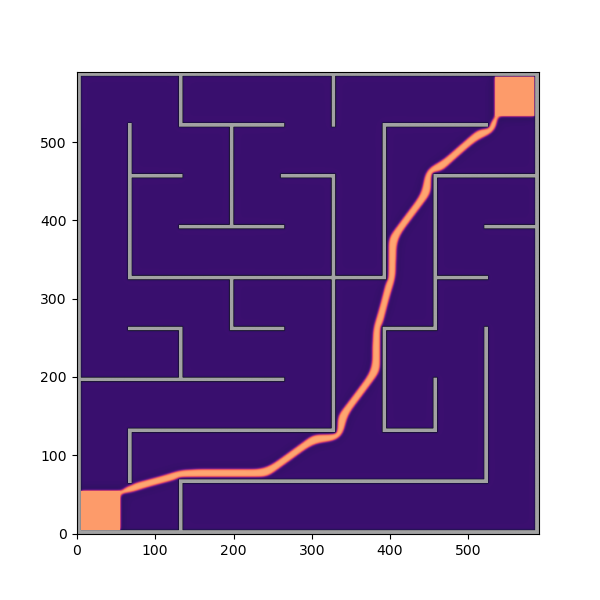

# Maze Solving with Reaction–Diffusion Systems (FitzHugh–Nagumo)

A NumPy + Numba numerical simulation of the **FitzHugh–Nagumo (FHN)** reaction–diffusion
model used to find the shortest path between two points. A travelling wave (autowave) floods the maze from the
start, and a second retracting wave traces the shortest path back — a biologically
inspired alternative to classical graph search.

> Part of my Physics Bachelor's Thesis (TFG) at the University of Santiago de
> Compostela (2025–2026). A deep-learning extension (U-Net) that learns to reproduce
> these paths in milliseconds is developed in a separate repository.

## Walkthrough

| Phase 1 — Expansion | |
|:---:|:---:|
|  |  |
| The autowave is seeded at the start corner. | It floods every corridor (walls block it). |

| Phase 2 — Retraction | |
|:---:|:---:|
|  |  |
| The wave retracts towards both corners… | …leaving only the optimal path lit. |

## The model

The system integrates the coupled reaction–diffusion PDEs:

$$\frac{\partial u}{\partial t} = \epsilon (u - u^3 - v + F) + D_u \nabla^2 u$$

$$\frac{\partial v}{\partial t} = (u - \alpha v + \beta) + D_v \nabla^2 v$$

- **`u`** — activator (the propagating wavefront).
- **`v`** — inhibitor.
- **`F`** — forcing matrix encoding the maze geometry: it suppresses the activator on
  walls, so the wave can only travel along corridors.

## How it works

| Phase | Script | Numerical scheme | What it does |
|-------|--------|------------------|--------------|
| 1 — Expansion | `main_expansion.py` | Dufort–Frankel | Generates a solvable maze and propagates the autowave from start to exit. |
| 2 — Retraction | `main_retraction.py` | FTCS | Loads the phase-1 state and retracts the wave to reveal the optimal path. |

Core modules:

- **`solver.py`** — numerical engine (`dufort_frankel`, `FTCS`). The per-step
  updates are parallel **Numba** (`@njit(parallel=True)`) kernels, ~20× faster
  than the equivalent vectorised NumPy and spread across all CPU cores. The
  first run pays a one-time JIT compilation of a few seconds.
- **`maze.py`** — maze generators:
  - `generate_maze_multiroute` — builds a maze with several disjoint routes
    (a short one and longer distractors) between opposite corners. This is the
    generator used to build the thesis dataset.
  - `generate_maze_perfect` — classic perfect maze (single path between any
    two cells) via DFS backtracking.

## Installation

```bash
pip install -r requirements.txt
```

## Usage

There are two ways to use this repository: **watch the algorithm solve a single maze**, or
**generate a dataset** of solved mazes to train Part 2.

### 1. Solve and visualize one maze (default)

```bash
# Phase 1 — expansion: generate a random maze and flood it with the autowave.
python main_expansion.py     # -> matrices_expansion/*.npy , frames_expansion/*.png

# Phase 2 — retraction: retract the wave to reveal the optimal path.
python main_retraction.py    # -> matrices_retraction/*.npy , frames_retraction/*.png ,
                             #    dataset/sample_0.npz
```

The solver saves a frame image every `plot_every` steps (set at the top of each `main_*.py`)
into `frames_expansion/` and `frames_retraction/` — flip through them to watch the wave
propagate and retract. You can also preview a maze on its own with `python maze.py`.

### 2. Generate a dataset for Part 2

Each run of `main_expansion.py` builds a **new random maze**, so running the two phases
repeatedly produces a varied dataset. Phase 2 writes `dataset/sample_<id>.npz` with keys
`maze` (field F, `< 0` = wall) and `solution` (final field u) — the exact format consumed by
**Part 2**, the U-Net that learns to solve mazes:
[Navigation_CNN](https://github.com/CarlosPoLopez/Navigation_CNN).

For this, first **set `plot_every = 0`** at the top of `main_expansion.py` and
`main_retraction.py` to skip the frame images (much faster, no disk clutter). Then loop,
giving each sample a unique id via `SAMPLE_ID`:

```bash
for i in $(seq 0 999); do
    python main_expansion.py
    SAMPLE_ID=$i python main_retraction.py
done
# -> dataset/sample_0.npz ... dataset/sample_999.npz
```

On a cluster, submit a SLURM array instead: `main_retraction.py` also picks up
`SLURM_ARRAY_TASK_ID` as the sample id. Parallel array tasks must not share the
`matrices_expansion/` scratch files, so run each task in its own working directory.

## Author

**Carlos Polo López** — BSc Physics, University of Santiago de Compostela.
Supervised by Alberto Pérez Muñuzuri and David García Selfa.
